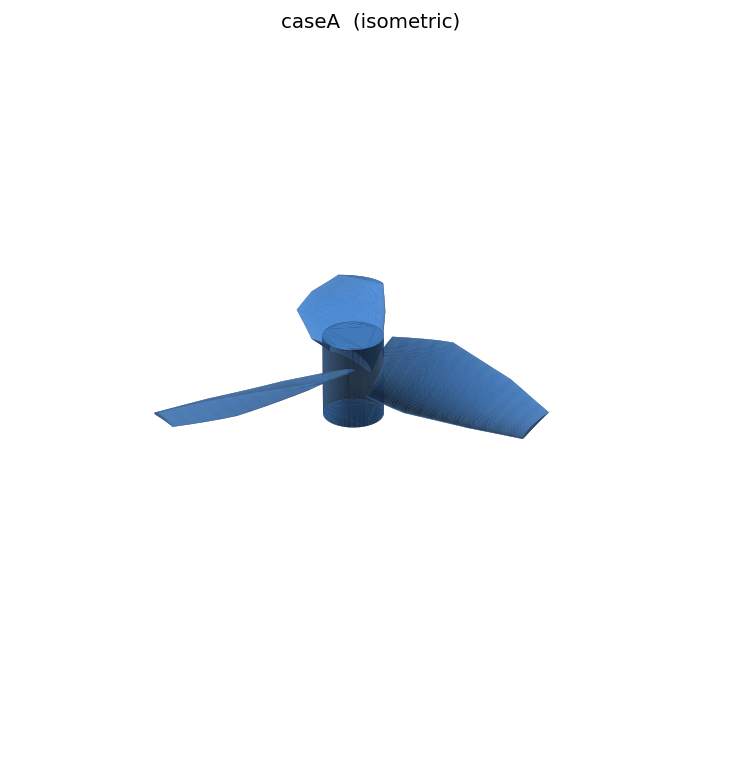
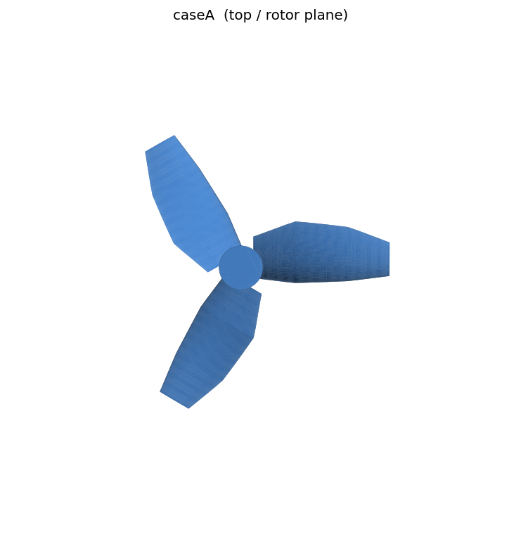

# Case A — 慣例的 3 枚翼プロペラ（基準形状）

共通の計算手法・条件は [00_method.md](00_method.md) を参照。

| | |
|---|---|
|  |  |
| アイソメ図 | 上面図（ロータ面） |

## 1. 設計のコンセプト

Case A は **慣例的なプロペラ設計** を基準（ベースライン）として用意した。Case B / Case C の
独自設計が「揚力最大化」という観点でどれだけ優れる（または劣る）かを測るための比較対象である。

着目点は以下の通り：

- **枚数 3 枚**、半径方向に **準等ピッチ**（根元で高ねじれ、翼端で低ねじれ）の標準的な配置。
- 翼型は **NACA 4 桁系（4 % キャンバ, 厚さ 8–12 %）**。一般的な低速プロペラに倣う。
- 翼弦は根元〜中央で広く、翼端でテーパする一般的な分布。

すなわち「教科書的なプロペラ」であり、これを 0 点として独自形状の優劣を評価する。

### 主要諸元（[scripts/caseA.json](../scripts/caseA.json)）

| 項目 | 値 |
|---|---|
| 枚数 | 3 |
| ハブ半径 / 高さ | 7 mm / 20 mm |
| 翼端半径 | 48 mm（掃引直径 96 mm < 100 mm ✓） |
| 軸方向寸法 | 20 mm（< 60 mm ✓） |
| 翼弦分布（根→端） | 16 → 22 → 18 → 11 mm |
| ねじれ分布（根→端） | 34° → 26° → 15° → 10° |
| 翼型 | NACA, キャンバ 4 %, 厚さ 12→8 % |

## 2. 計算条件

[00_method.md](00_method.md) の共通条件（空気, 100 rpm, MRF 凍結ロータ, k–ωSST,
外周全圧 0）に従う。Case A 固有のメッシュ：

| メッシュ | 表面細分化 | 総セル数 | プロペラ壁面 |
|---|---|---|---|
| 粗（level 3） | ≈1.25 mm | 142,048 | 3,562 面 |
| 細（level 4） | ≈0.47 mm | 1,176,516 | 多数 |

- 翼端速度 \(U_{tip}=0.50\) m/s、翼弦レイノルズ数 \(Re_c \approx 5\times10^2\)（低 Re, 層流寄り）。

## 3. 考察（結果）

### 推力・トルク

| メッシュ | 推力 \(|F_z|\) [N] | トルク \(M_z\) [N·m] | 圧力/粘性 \(F_z\) |
|---|---|---|---|
| level 3（142k） | **1.94×10⁻⁶** | 9.0×10⁻⁸ | −2.12e-6 / +1.80e-7 |
| level 4（1.18M） | **1.58×10⁻⁶** | 5.2×10⁻⁸ | −1.64e-6 / +6.1e-8 |

- **オーダー妥当性**：推力係数 \(C_T = |F_z|/(\rho n^2 D^4) \approx 1.58\text{e-}6 / 2.9\text{e-}4 \approx 5.5\times10^{-3}\)。
  100 rpm という極低速のため絶対値は **数 µN** と極めて小さく、これは物理的に妥当な範囲である。
- **メッシュ依存性**：level 3→4 で推力は 1.94→1.58 µN（約 −19 %）。同オーダーで収まっており、
  定性比較には十分だが、**絶対値には ±20 % 程度の不確かさ**がある。
- 推力は圧力成分が支配的（粘性は約 4–10 %）。

### 収束挙動（重要な注意）

level 4 では \(F_z\) が反復初期に増大（ピーク −2.74 µN @ t≈650）した後，**緩やかに減少して
−1.6 µN 付近に漸近**した。これは MRF ホバリング解で誘起流入（ダウンウォッシュ）が発達し，
翼素の有効迎角が下がって推力が低下する物理を反映している。

また収束後も横力 \(F_x, F_y\)（約 1×10⁻⁶ N）が推力と同オーダーで残存した。本来 3 回対称で
ゼロに近いはずであり，**この推力レベルでは数値ノイズ・非対称メッシュの影響が相対的に大きい**
ことを意味する。絶対値の議論には限界があり，**最終評価は Autodesk CFD で行う**
（[10_autodesk_cfd.md](10_autodesk_cfd.md)）。

### 流れ場

- ロータ面を通過する軸方向（−Z 方向に押し下げ）の誘起流が形成され，反作用としてプロペラに
  +Z 方向の推力が働く（符号は回転方向・ピッチ符号に依存。本レポートでは大きさ \(|F_z|\) を推力と定義）。
- 低 Re のため翼端渦は弱く，粘性拡散が卓越する。

## 4. まとめ

- 慣例的 3 枚翼プロペラを基準形状として確立した。100 rpm での推力は **1.6–1.9 µN オーダー**。
- メッシュ依存性は約 20 %，誘起流入による推力低下と横力ノイズを確認。**相対比較の基準**として用いる。
- Case B（独自・翼端荷重型 8 枚翼）との比較は [caseB.md](caseB.md)，総括は [summary.md](summary.md)。

## 5. 参考文献

1. J. G. Leishman, *Principles of Helicopter Aerodynamics*, 2nd ed., Cambridge Univ. Press, 2006.（ロータ空力・運動量理論・誘起流入）
2. I. H. Abbott, A. E. von Doenhoff, *Theory of Wing Sections*, Dover, 1959.（NACA 翼型）
3. OpenFOAM Foundation, *OpenFOAM v12 User Guide* — MRF, `incompressibleFluid`, `snappyHexMesh`, `forces`. https://openfoam.org
4. M. Drela, "Low-Reynolds-Number Airfoil Design," MIT, lecture notes.（低 Re 翼型の特性）
