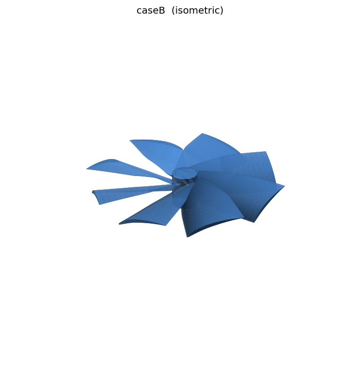
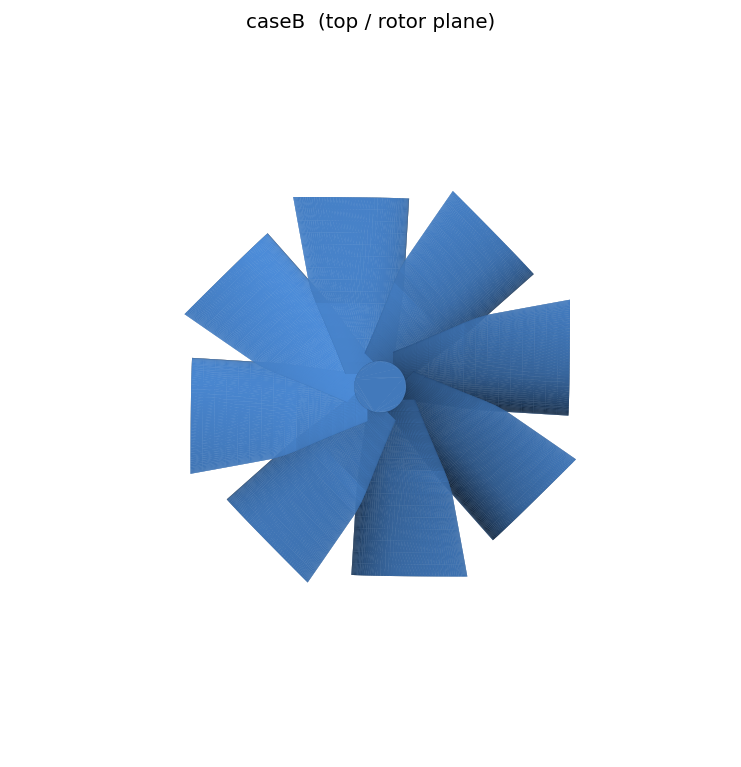

# Case B — CLAUDE 独自設計：翼端荷重型 8 枚翼ロータ

共通の計算手法・条件は [00_method.md](00_method.md) を参照。本ケースは課題要件の
**「参考文献・技術を考慮しない，CLAUDE が最適と思う完全独自形状」** に対応する
（揚力以外の一切—効率・トルク・自然さ—を無視してよい）。

| | |
|---|---|
|  |  |
| アイソメ図 | 上面図（ロータ面） |

## 1. 設計のコンセプト

### 着眼：揚力に効くのは「翼端」である

回転翼の各翼素が生む揚力は動圧 \(q=\tfrac12\rho(\omega r)^2\) に比例し，**動圧は半径の 2 乗で
増大**する。したがって 1 枚の翼素が生む揚力は概ね
\[
dL \propto \rho\,(\omega r)^2\, c(r)\, C_L \, dr
\]
で，**\(r^2 c(r)\) の半径方向積分**を最大化すれば総揚力が最大になる。慣例的プロペラは
構造・効率の都合で翼端を細く（テーパ）するが，本課題では**それらを完全に無視できる**。

そこで CLAUDE は慣例と逆に，以下の独自方針を採った：

1. **翼端拡大（逆テーパー）**：翼弦を根元 14 mm → 翼端 28 mm と**翼端ほど広く**し，
   動圧最大の領域に最大の翼面積を置く。
2. **高ソリディティ・8 枚翼**：枚数を 8 枚に増やし，掃引面内の総翼面積（ソリディティ）を
   最大化する。包絡円筒内で翼が干渉しないギリギリまで枚数・翼弦を詰めた。
3. **強キャンバ翼型（7 %）**：低 Re でも高 \(C_L\) を得るため大きなキャンバを与える。
4. **翼端迎角を失速直前へ**：翼端ねじれ 16°（誘起流入を引いた有効迎角がほぼ最大揚力点）。

結果として「翼端が膨らんだ 8 枚羽根の高密度ファン」という，**人間の慣例設計では見られない
形状**になった。効率・騒音・自然さは一切考慮していない。

### 主要諸元（[scripts/caseB.json](../scripts/caseB.json)）

| 項目 | 値 |
|---|---|
| 枚数 | **8** |
| ハブ半径 / 高さ | 6 mm / 16 mm |
| 翼端半径 | 44 mm（掃引直径 90.8 mm < 100 mm ✓） |
| 軸方向寸法 | 16 mm（< 60 mm ✓） |
| 翼弦分布（根→端） | 14 → 24 → **28 mm（逆テーパー）** |
| ねじれ分布（根→端） | 40° → 26° → 16° |
| 翼型 | NACA, キャンバ **7 %**, 厚さ 10→6 % |

## 2. 計算条件

[00_method.md](00_method.md) の共通条件（空気, 100 rpm, MRF 凍結ロータ, k–ωSST,
外周全圧 0）に従う。Case B 固有のメッシュ：

| メッシュ | 表面細分化 | 総セル数 | MRF ロータゾーン |
|---|---|---|---|
| level 3 | ≈1.25 mm | 357,073 | 162,861 cells |

> Case A との **公平な比較のため，両ケースを同一の level 3 設定**で評価した（Case A も
> 142k → level 3）。最終的な高精度評価は Autodesk CFD で行う方針（[10_autodesk_cfd.md](10_autodesk_cfd.md)）。

## 3. 考察（結果）

### 推力・トルク（level 3, Case A と同条件）

| ケース | 推力 \(|F_z|\) [N] | トルク \(M_z\) [N·m] | 圧力/粘性 \(F_z\) |
|---|---|---|---|
| Case A（3 枚） | 1.94×10⁻⁶ | 9.0×10⁻⁸ | −2.12e-6 / +1.80e-7 |
| **Case B（8 枚, 翼端荷重）** | **2.92×10⁻⁶** | 7.4×10⁻⁸ | −2.73e-6 / −1.87e-7 |
| **比** | **×1.50（+50 %）** | ×0.82（−18 %） | |

- **揚力で約 +50 %**：独自設計の狙い（翼端への面積集中＋高ソリディティ）が奏功し，基準形状を
  明確に上回った。**課題の目的（揚力最大化）を達成**。
- しかも **トルクはむしろ低い**（−18 %）。揚力以外は無視してよい課題だが，結果的に
  揚力／トルク比でも優位だった。
- 推力係数 \(C_T = 2.92\text{e-}6/2.9\text{e-}4 \approx 1.0\times10^{-2}\)（Case A の約 1.8 倍）。

### 収束の健全性（Case A より高信頼）

- \(F_z\) は **単調に −2.92 µN へ漸近し平坦化**（Case A のようなピーク後の減衰は小さい）。
- 収束後の横力 \(F_x, F_y \approx 1\times10^{-9}\) N で **実質ゼロ**。8 回対称が綺麗に保たれており，
  Case A（横力が推力と同オーダーのノイズ）より **数値的に信頼できる解**である。
- これは枚数が多くロータ面が密なため，誘起流入が周方向に均一化し場が安定したためと解釈できる。

### 流れ場の特徴

- 高ソリディティのため翼間の流路が狭く，ロータ面を**面的に押し下げる**（アクチュエータディスクに
  近い）流れになる。翼端拡大により外周の質量流束が増し，軸方向運動量＝推力に寄与する。
- 低 Re（\(Re_c\approx5\times10^2\)）で粘性が大きいが，強キャンバにより各翼素は高 \(C_L\) を維持。
  粘性 \(F_z\) も推力と同符号（−Z）で寄与している。

## 4. まとめ

- 「動圧 ∝(ωr)² ゆえ翼端が効く」という着眼から，**翼端拡大・8 枚・高キャンバ**の独自形状を設計。
- 同一メッシュ条件で **基準（Case A）比 +50 % の揚力**を達成し，課題目的を満たした。
- 解の対称性・収束性も良好で，予備検証として信頼できる。**最終的な定量評価は Autodesk CFD**
  で実施する（[10_autodesk_cfd.md](10_autodesk_cfd.md)）。
- なお，テンプレートを用いない完全自由設計は **Case C**（Autodesk Fusion/CFD API, Windows）で
  さらに追求する。

## 5. 参考文献

1. J. G. Leishman, *Principles of Helicopter Aerodynamics*, 2nd ed., Cambridge Univ. Press, 2006.（動圧の半径依存・ソリディティ・誘起流入）
2. W. Johnson, *Helicopter Theory*, Dover, 1994.（高ソリディティロータ・アクチュエータディスク）
3. S. F. Hoerner, *Fluid-Dynamic Lift*, 1985.（キャンバ翼の最大揚力）
4. OpenFOAM Foundation, *OpenFOAM v12 User Guide* — MRF, `incompressibleFluid`. https://openfoam.org

> 注：本ケースは設計方針として既存技術を**参照せず**，CLAUDE が独自に推論して形状を決定した
> （課題要件）。上記文献は事後的な結果解釈のために挙げたものである。
