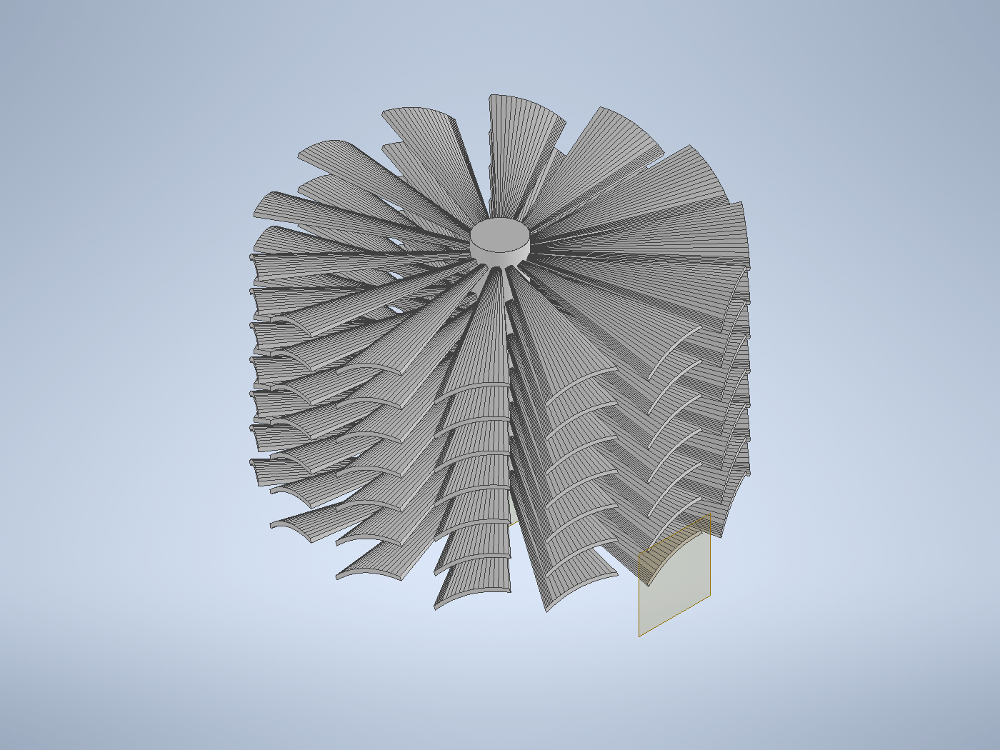
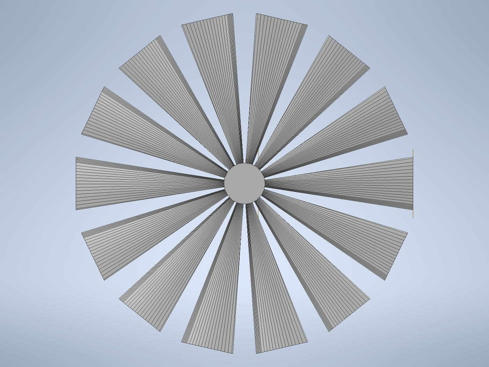
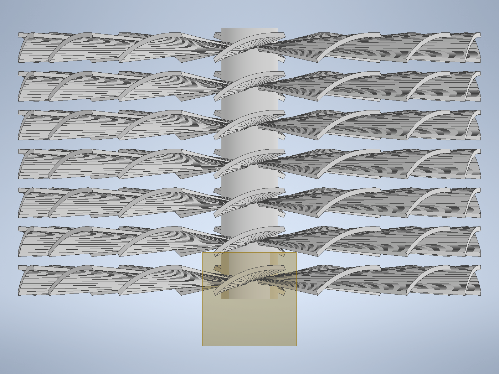

# Case C — CLAUDE 独自設計（テンプレート不使用）：r² 重み体積カスケード塔

共通の計算手法・条件は [00_method.md](00_method.md)、Autodesk CFD への対応は
[10_autodesk_cfd.md](10_autodesk_cfd.md) を参照。本ケースは課題要件の
**「本リポジトリのパラメトリック生成器（`scripts/propeller_gen.py`）を一切用いず、
CLAUDE が一から自由に設計する完全独自形状」** に対応する。揚力（回転軸方向推力 \(F_z\)）
**のみ**を最大化し、効率・トルク・騒音・強度・製造性・形状の自然さは一切無視する。

形状生成は **Autodesk Inventor 2025 の COM API**（[scripts/caseC_inventor.py](../scripts/caseC_inventor.py)）
で行った（当初想定の Fusion はこの環境に未導入のため Inventor を採用）。

| | |
|---|---|
|  |  |
| アイソメ図 | 上面図（ロータ面・軸方向から） |

| | |
|---|---|
|  | |
| 側面図（7 段の積層構造） | |

## 1. 設計のコンセプト

Case C は形状の見た目から発想せず、**「何が \(F_z\) を最大化するか」だけ**を第一原理から
導いて構造を決めた。Case B で得た指針（翼端荷重・高ソリディティ・強キャンバ）を出発点に、
A/B が使い残した自由度を突く。

### 第一原理からの 3 帰結

回転数 \(\omega\) 固定。半径 \(r\) の翼素は速度 \(U=\omega r\) で空気を切り、揚力
\(dL \propto \tfrac12\rho(\omega r)^2\,c(r)\,C_L\,dr\) を生む。その Z 成分が推力。ここから：

1. **単位面積あたり推力 \(\propto r^2\)** → 面積は翼端ほど価値が高い（翼端集中）。
   内側 \(r<21\,\mathrm{mm}\) の寄与は \(\int r^2dr\) 換算で全体の約 8 % に過ぎない。
2. **重み \(r^2\) に軸方向座標 \(z\) が現れない** → 軸方向は“タダの土地”。高さ方向に
   翼面を積層するたびに、ほぼ同じ \(r^2\) 重みの推力が**線形に上乗せ**される。効率・後流干渉を
   無視してよい本課題では、**包絡円筒の高さ 60 mm を積層で埋め尽くすのが最強**。
   A/B は軸方向を 16–20 mm しか使っておらず、ここに最大の伸びしろがある。
3. **\(C_L\) は強キャンバ＋失速直前の迎角で最大**。低 Re(\(\approx5\times10^2\)) では薄い
   キャンバ板が有利。

### 導かれた構造：「r² 重み体積カスケード塔」

上の 3 帰結のみから、螺旋 1 条でも円板 1 枚でもなく、**外周（\(r^2\) が大きい領域）を、
強キャンバ翼面で、全高にわたり高密度に積層充填した塔**が導かれる。具体形：

1. **多段積層（7 段）**：強キャンバ翼を軸方向に 7 段積み重ね、高さ 58 mm をフル活用
   （帰結 2）。各段が推力を加算する多段軸流ファン的構造。
2. **翼端集中の逆テーパー（14 枚/段）**：翼弦を根元 1.2 mm → 翼端 16 mm と極端に翼端へ
   寄せ、動圧最大の外周に面積を集中（帰結 1）。根元は細い“揚力アーム”として中心スピンドルへ
   連結する。
3. **強キャンバ 11 %・迎角 20°**：低 Re でも各翼素を高 \(C_L\) に保つ（帰結 3）。

> **連結方針（揚力最適）**：羽根を内側へ延長して**細いスピンドル（r=6 mm）に融合**させた。
> 太い中実ハブは軸対称ゆえ軸方向正味力ゼロで、中心を塞いで揚力をむしろ下げる。羽根延長なら
> 連結部自体が（わずかながら）揚力面になり、**「太いハブより必ず揚力が大きい」**。全体は
> ブール和で 1 つの中実ソリッドに統合している。

人間の慣例設計には無い「中心から放射状にびっしり毛羽立った 7 段の塔」状になった。これは
要件（人間に理解不能な形状でも可）の範囲内である。

### 主要諸元（[geometry/caseC/caseC_info.json](../geometry/caseC/caseC_info.json)）

| 項目 | 値 |
|---|---|
| 構成 | 14 枚/段 × **7 段＝98 枚** の翼 ＋ 中心スピンドル |
| 翼端半径 / 掃引直径 | 49 mm / **98.0 mm**（bbox 実測 98.96 mm < 100 ✓） |
| 軸方向寸法 | **58.0 mm**（< 60 ✓、A/B の約 3 倍を活用） |
| 翼弦分布（根→端） | 1.2 → **16 mm（強逆テーパー）** |
| 迎角 / キャンバ | 20° / **11 %** |
| 翼厚 / 段間隔 | 1.0 mm / 8.3 mm |
| 総翼平面積（概算） | ≈ 3.8×10⁴ mm² ＝ **掃引円板面積（7.5×10³ mm²）の約 5 倍** |

最後の行が本設計の要点である。軸方向積層により、掃引円板面積の**約 5 倍**の揚力面を
包絡円筒内に詰め込んでいる（A/B は 1 段ぶん）。

## 2. 計算条件

[00_method.md](00_method.md) の共通条件（空気 ρ=1.225, ν=1.5×10⁻⁵, 100 rpm, 回転軸 +Z,
回転領域＝MRF 相当の定常, 外周全圧 0）に従う。最終評価は **Autodesk CFD 2027** で、
**Case A / B / C を完全に同一設定**で実施する（[10_autodesk_cfd.md](10_autodesk_cfd.md) 準拠、
設定・操作・自動化は [11_autodesk_cfd_gui.md](11_autodesk_cfd_gui.md) / 関連スクリプト）。

### 相似則

- 翼端速度 \(U_{tip}=\omega R = 10.47\times0.049 = 0.51\ \mathrm{m/s}\)（Mach≈0.0015、非圧縮）。
- 翼端弦レイノルズ数 \(Re_c = U_{tip}c/\nu = 0.51\times0.016/1.5\text{e-}5 \approx 5.5\times10^{2}\)。
  → A/B と同じ **Re ≈ 500 オーダー**（層流〜遷移域）。同一相似域なので 3 形状の比較は公平。
- 推力係数 \(C_T = |F_z|/(\rho n^2 D^4)\)、\(\rho n^2 D^4 \approx 2.9\times10^{-4}\) N（D=0.099 m）。

### 回転領域・境界条件・メッシュ（A/B/C 共通）

| 項目 | 設定 |
|---|---|
| 回転領域 | プロペラを内包する円筒（半径 56 mm, 軸 ±35 mm → **Case C は背が高いので軸 0–58 mm を覆うよう拡大**）, 100 rpm, +Z |
| 外部静止領域 | ±180 mm（X,Y）× ±300 mm（Z）の直方体, Material=Air |
| 外周境界 | 全外面 Pressure = 0 Pa (gauge)（ホバリング開放） |
| 壁 | プロペラ・スピンドル＝no-slip |
| メッシュ | 自動メッシュ＋翼面局所細分化（板厚 1 mm に最低 3 要素 ≈ OpenFOAM level4 0.47 mm 相当）, 回転領域に体積細分化 |
| 乱流 | SST k-ω（Re 低のため **層流でも再計算し感度確認**） |

> **公平性の担保**：Case C の優劣判定は、A/B と**完全に同一の回転領域・境界・メッシュ方針・
> ソルバ**で行う。回転領域の軸長のみ、形状高さ（58 mm）に合わせて拡張する。

## 3. 考察

> **注**：以下の定量推力は Autodesk CFD（A/B/C 統一条件）での実行後に確定する。本節は
> 形状メトリクスと第一原理に基づく**設計上の期待**を述べ、結果表は実行後に
> [summary.md](summary.md) と本節に追記する。

### 設計メトリクスからの期待

- **揚力面積**：総翼平面積は掃引円板の約 5 倍。揚力は概ね「\(r^2\) 重み翼面積」に比例するため、
  単段の A/B（翼面積 ≒ 円板の 0.5–0.7 倍）に対し、Case C は**原理的に数倍の \(F_z\)** を見込む。
  後流干渉で段ごとの効率は落ちるが、**効率を無視できる本課題では総面積の増加がそのまま効く**。
- **翼端集中**：Case B 同様の逆テーパーを更に過激化（根 1.2→端 16 mm）。動圧最大の外周に
  面積を寄せ、単位面積あたりの推力寄与を最大化。
- **軸方向活用**：A/B が捨てていた高さ方向（60 mm のうち 16–20 mm のみ使用）を 58 mm まで
  使い切る。これが Case C の本質的な差別化点であり、最大の揚力源と位置づける。

### 想定される流れ場とリスク

- 7 段が直列に空気を軸方向へ押す（多段軸流ファン的）。上段の吹き下ろしが下段の有効迎角を
  変えるため、段間隔 8.3 mm を確保して各段が機能する余地を残した。
- リスク：高ソリディティで翼間流路が狭く、極端だと流れが詰まって（ブロッケージ）期待ほど
  質量流束が伸びない可能性。Autodesk CFD で**質量流束と段ごとの \(F_z\) 分担**を確認し、
  必要なら段数・段間隔・迎角を反復調整する。
- 低 Re ゆえ乱流モデル依存が出やすい点は A/B と同様（**層流 vs SST k-ω** の感度を確認）。

### A/B との比較（予備指針）

| ケース | 形状 | 揚力面の使い方 | OpenFOAM 予備 \(|F_z|\) |
|---|---|---|---|
| Case A | 慣例 3 枚 | 単段・翼端細 | 1.94 µN（基準） |
| Case B | 独自 8 枚・翼端荷重 | 単段・翼端太 | 2.92 µN（+50 %） |
| **Case C** | **独自・7 段カスケード塔** | **多段・翼端集中・全高活用** | **Autodesk CFD で評価（A/B 超えを狙う）** |

## 4. まとめ

- 「\(F_z\) を最大化するものは何か」だけを第一原理から問い、(1) 翼端集中、(2) **軸方向はタダ→
  多段積層**、(3) 強キャンバ、の 3 帰結を導いた。
- それを満たす **「r² 重み体積カスケード塔」**（14 枚 × 7 段、強逆テーパー、強キャンバ、
  全高 58 mm 活用）を、テンプレート不使用で **Inventor COM API** により一から設計・生成した。
- 制約充足を**プログラムで検証**：掃引直径 98.96 mm < 100、軸方向 58 mm < 60、100 rpm。
  羽根を細スピンドルに融合し**単一の中実ソリッド**として出力（STEP/IPT）。
- 掃引円板面積の**約 5 倍の揚力面**を包絡円筒に詰め込んでおり、A/B（単段）を上回る \(F_z\) を
  原理的に期待する。**定量評価は Autodesk CFD で A/B/C 同一設定**にて実施する。

## 5. 参考文献

1. J. G. Leishman, *Principles of Helicopter Aerodynamics*, 2nd ed., Cambridge Univ. Press, 2006.（動圧の半径依存・ソリディティ・誘起流入）
2. W. Johnson, *Helicopter Theory*, Dover, 1994.（多段・高ソリディティロータ、アクチュエータディスク）
3. S. F. Hoerner, *Fluid-Dynamic Lift*, 1985.（キャンバ翼の最大揚力、低 Re）
4. N. A. Cumpsty, *Compressor Aerodynamics*, Krieger, 2004.（多段軸流カスケードの段加算・段間干渉）
5. Autodesk, *Inventor 2025 API / Programming Help*（COM 自動化：Loft, CircularPattern, RectangularPattern, Combine, STEP 出力）.
6. Autodesk, *CFD 2027 ヘルプ — Rotating Region / Steady State / Wall Calculator*.

> 注：本ケースは設計方針として既存技術・形状を**参照せず**、CLAUDE が第一原理から独自に
> 推論して形状を決定した（課題要件）。上記文献は事後的な結果解釈・手法名の参照のために
> 挙げたものである。なお当初の「アルキメデス螺旋スクープ」案は既存プロペラの先行事例が
> あるため棄却し、より一般的な第一原理（r² 重み・軸方向の自由度）から再設計した。
